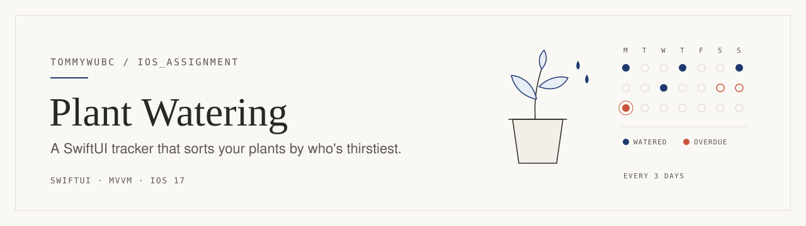
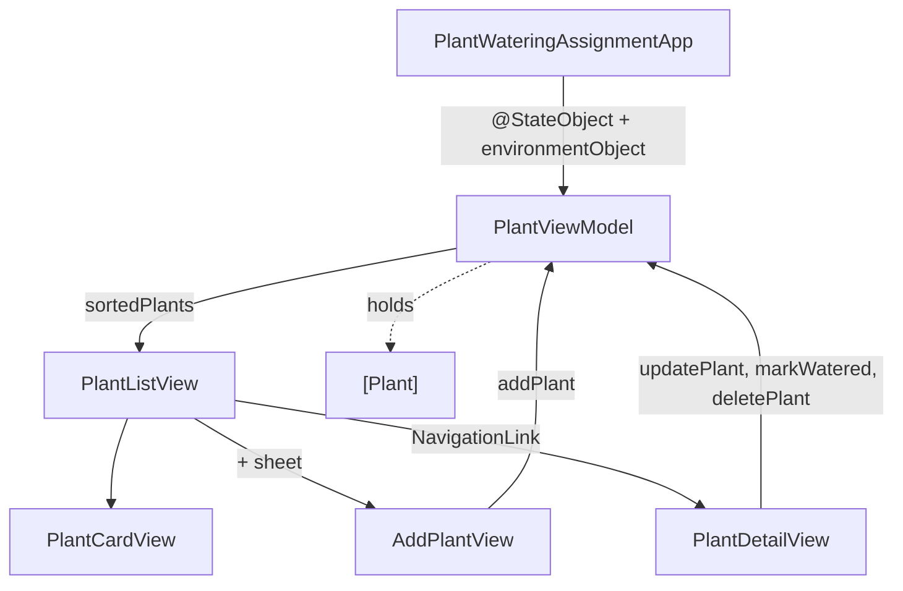

<picture>
  <source media="(prefers-color-scheme: dark)" srcset=".github/assets/banner-dark.svg">
  
</picture>

A small SwiftUI app that tracks when each of your plants needs water. You add a plant and pick how often it gets watered, and the list sorts itself so the thirstiest plant is always on top. I built it for a class assignment. The original spec is in [docs/ASSIGNMENT.md](docs/ASSIGNMENT.md).

## What it does

**The list.** Each plant is a card showing its emoji, name, interval, and next due date ("Every 3 Days • Next: Sep 14"). The row color tells you how urgent it is:

| State | When | Card |
| --- | --- | --- |
| Overdue | due date is before today | red row, "2 days overdue" label |
| Due today | due date is today | yellow row, orange "Due today" label |
| Upcoming | due date is after today | default background |

Sorting is overdue first, then due today, then upcoming. Inside each group, the plant with the higher `daysOverdue` comes first, so the most neglected plant leads and the upcoming ones are ordered soonest first.

**Adding a plant.** The `+` button opens a sheet with a name field, a 4×2 grid of eight emoji (🌵 🌿 🌸 🌻 🪴 🍀 🌱 🌾), and an interval picker: every day, 3 days, week, 2 weeks, or month (30 days). "Last watered" is set to now. **Add** stays disabled until the name has something other than whitespace in it.

**Detail and edit.** Tapping a card opens a form where you edit the name and interval in place. Every change is written back to the view model right away, so there's no save button. The form also shows the next watering date and a status line, plus:

- **Mark as Watered** sets `lastWatered` to now and goes back to the list, where the card moves to its new position.
- **Delete Plant** asks for confirmation first ("This action cannot be undone.").

## How it's built

It's plain MVVM with one shared view model:

- **`Plant`** is a value type (`Identifiable`, `Codable`). It stores `lastWatered` and `interval` and computes everything else: `nextWateringDate`, `daysOverdue` (whole calendar days, compared at the start of each day), and `urgency`.
- **`PlantViewModel`** is a `@MainActor ObservableObject` that owns `@Published var plants`. It exposes `sortedPlants` and four mutations: add, update, mark watered, and delete.
- **Views** never change a `Plant` themselves. They call the view model, which republishes the list, and SwiftUI redraws it.



## Run it

You need Xcode with the iOS 17 SDK or newer (the deployment target is iOS 17.0).

1. Open `PlantWateringAssignment.xcodeproj`.
2. Choose the `PlantWateringAssignment` scheme and an iPhone or iPad simulator.
3. Run with ⌘R.

Each view also has a `#Preview`, so you can try the screens in the Xcode canvas without launching the app.

## Repository layout

```
PlantWateringAssignment.xcodeproj/     Xcode project and shared scheme
PlantWateringAssignment/
  PlantWateringAssignmentApp.swift     entry point, creates the view model
  Plant.swift                          model, WateringInterval, Urgency, date formatting
  PlantViewModel.swift                 state, sorting, CRUD
  Views/
    PlantListView.swift                list, urgency colors, PlantCardView
    AddPlantView.swift                 add sheet
    PlantDetailView.swift              inline edit, mark watered, delete
docs/ASSIGNMENT.md                     the original assignment spec
```

## Notes and limits

- **Nothing persists.** Plants live in memory, so quitting the app clears the list. `Plant` is already `Codable`, which makes saving to disk or `@AppStorage` the obvious next step.
- **New plants can't start overdue.** "Last watered" is always now, so the red state only shows up once real days have passed (or once you change the device's date).
- "Every Month" means exactly 30 days.
- The spec's file tree lists unit and UI test targets. This project doesn't include them.
